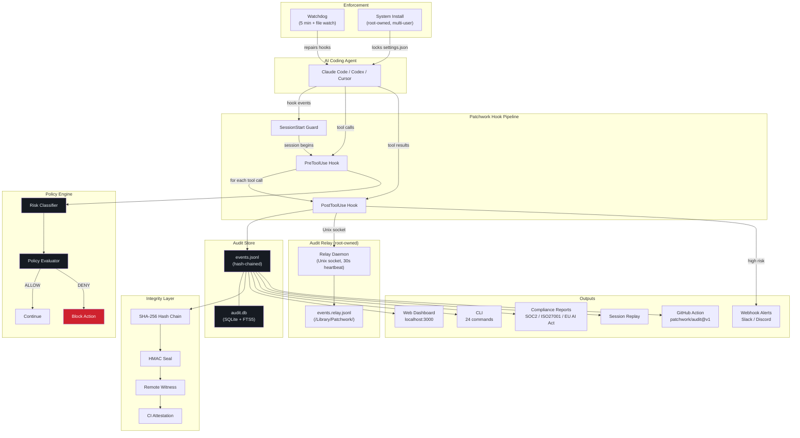

# Patchwork

**The audit trail for AI coding agents.**

AI agents are black boxes. They read your files, execute commands, make web requests, and modify your codebase -- and you have no record of what they did or why. As organisations adopt AI coding assistants, this becomes a compliance and security problem:

- **The EU AI Act** requires logging of AI system outputs and decision-making processes
- **SOC 2 / ISO 27001** demand audit trails for systems that access production code and infrastructure
- **Enterprise security teams** can't approve AI tools they can't monitor
- **Developers** can't trust autonomous agents they can't audit after the fact

Patchwork solves this. It hooks into AI coding agents and records everything they do -- files read, files written, commands executed, web requests made -- into a tamper-evident, queryable audit trail with real-time risk classification and policy enforcement.

**Local-first.** Your data never leaves your machine. No cloud. No telemetry. Everything works offline.

**Tamper-resistant.** The AI agent cannot disable its own monitoring, corrupt the audit log, or weaken the security policy. A 5-layer tamper-proof architecture -- from hash chains to a root-owned relay daemon -- makes it impossible for non-admin users to remove.

**Policy enforcement.** Define what the AI can and cannot do. Patchwork blocks dangerous actions in real-time -- before they execute.

---

## What it catches

```
15:31:04  claude-code   command_execute   rm -rf /                    CRITICAL  DENIED
15:31:05  claude-code   file_read         .env                        HIGH      DENIED
15:31:07  claude-code   command_execute   git push --force origin     HIGH      DENIED
15:31:08  claude-code   command_execute   sudo rm /etc/hosts          CRITICAL  DENIED
15:31:10  claude-code   file_edit         src/auth/middleware.ts       MEDIUM    completed
15:31:12  claude-code   command_execute   npm test                    MEDIUM    completed
```

Every action is classified, logged, and -- if it violates policy -- blocked before it executes.

---

## Quickstart

```bash
git clone https://github.com/JonoGitty/patchwork-audit.git
cd patchwork-audit
pnpm install && pnpm build

# Install CLI globally
cd packages/cli && npm link && cd ../..

# Set up hooks with strict enforcement
patchwork init claude-code --strict-profile --policy-mode fail-closed

# See what the AI is doing
patchwork dashboard      # web UI at localhost:3000
patchwork log            # CLI event stream
patchwork summary        # today's activity
```

### System-level install (tamper-proof)

For managed machines where non-admin users should not be able to disable auditing:

```bash
# Single user
sudo bash scripts/system-install.sh

# All users on this Mac
sudo bash scripts/system-install.sh --all-users

# Specific users
sudo bash scripts/system-install.sh --users alice,bob,charlie
```

This locks `settings.json` as root-owned with the system immutable flag, installs a LaunchDaemon watchdog, and makes it impossible for the AI agent or non-admin users to disable monitoring.

### Audit relay daemon (v0.5.0+)

For defence-in-depth, deploy the root-owned audit relay. The relay is a separate daemon that receives copies of every audit event via Unix socket and writes them to its own append-only log. Even if an attacker compromises the user-space audit store, the relay's copy is intact.

```bash
# Deploy the relay (installs LaunchDaemon, creates /Library/Patchwork/)
sudo bash scripts/deploy-relay.sh

# Manage the relay
patchwork relay status         # Check health + heartbeat (queries daemon via socket)
patchwork relay verify         # Verify relay-side hash chain
```

The relay runs a 30-second heartbeat, maintains its own independent SHA-256 hash chain, auto-seals every 15 minutes with HMAC-SHA256, and acts as a signing proxy for commit attestations.

### Commit attestations (v0.6.1)

Every `git commit` made by the AI agent automatically generates a signed compliance proof:

```bash
# View the attestation on any commit
git notes --ref=patchwork show HEAD

# Output:
# Patchwork-Approved: sha256:fa02b189...
# Status: PASS
# Session: c68f85c5-24ca-402c-bf2c-...
# Chain: valid (52 events, tip: sha256:689c54f3...)
# Risk: 0 critical, 0 high, 35 medium
# Policy: system:/Library/Patchwork/policy.yml
```

Attestations include session event count, risk summary, chain integrity status, and an HMAC signature from the relay daemon's root-owned keyring. Full attestation JSON is stored at `~/.patchwork/commit-attestations/<sha>.json`.

---

## How it works

```
Claude Code                    Patchwork                        Audit Store
    |                              |                                |
    |-- PreToolUse hook ---------> |                                |
    |                              |-- classify risk                |
    |                              |-- evaluate policy              |
    |                              |-- ALLOW or DENY ------------> stdout
    |                              |                                |
    |-- PostToolUse hook -------> |                                |
    |                              |-- record event                |
    |                              |-- compute hash chain -------> events.jsonl
    |                              |-- index -------- -----------> audit.db (SQLite)
    |                              |-- relay event via socket ---> /Library/Patchwork/events.relay.jsonl
    |                              |-- webhook alert (if high risk)|
```

Patchwork hooks into Claude Code's native hook system. Every tool call passes through the policy engine before execution. Denied actions are blocked and logged. Completed actions are recorded with tamper-evident hash chaining and forwarded to the root-owned audit relay.

---

## Web Dashboard

`patchwork dashboard` launches a local web UI with six pages:

| Page | What you see |
|------|-------------|
| **Overview** | Stat cards, 14-day activity chart, risk donut, recent events + sessions |
| **Events** | Filterable event log with live htmx filtering (agent, action, risk) |
| **Sessions** | Session list with drill-down timeline -- every action the AI took |
| **Risk** | Risk-over-time chart, flags breakdown, denials table |
| **Search** | Full-text search across all events (powered by SQLite FTS5) |
| **Settings** | System status, installed agents, policy rules display |

Plus a JSON API at `/api/stats`, `/api/events`, `/api/sessions`, `/api/risk-timeline`.

---

## Policy Enforcement

Policies are YAML files that define allow/deny rules. When a policy denies an action, Patchwork blocks it in real-time.

```yaml
name: my-team-policy
max_risk: high  # Auto-deny anything above this level

files:
  deny:
    - pattern: "**/.env"
      reason: Environment files contain secrets
    - pattern: "**/.claude/settings.json"
      reason: Audit hooks must not be modified
    - pattern: "**/.patchwork/**"
      reason: Audit data must not be tampered with
  default_action: allow

commands:
  deny:
    - prefix: "rm -rf"
      reason: Recursive force delete
    - prefix: sudo
      reason: Elevated privileges
    - prefix: "git push --force"
      reason: Force push blocked
  default_action: allow
```

Built-in presets: `default` (audit-only) and `strict` (blocks dangerous operations).

### Self-protection

The AI agent cannot disable its own monitoring:

| Attack vector | Defence |
|---|---|
| Editing settings.json to remove hooks | Policy deny rule + file locked as root:wheel + schg flag |
| Truncating/deleting the audit log | Policy deny rule + command regex blocks redirects + relay has independent copy |
| Weakening the security policy | Policy deny rule blocks writes to policy.yml |
| Timeout-based bypass | Fail-closed mode denies on hook timeout |
| Shell metacharacter evasion | Regex command rules catch pipes/redirects |
| Compromising user-space audit store | Root-owned relay daemon maintains independent hash-chained copy |

### Fail-closed mode

When installed with `--policy-mode fail-closed`, any hook error (crash, timeout, bad input) results in the action being **denied** rather than allowed.

---

## Risk Classification

Every event is automatically classified:

| Level | Example triggers |
|---|---|
| **CRITICAL** | `.env` access, `rm -rf`, `sudo`, SSH key files |
| **HIGH** | `package.json` modification, `npm install`, force push, credential files |
| **MEDIUM** | File writes, command execution, web requests, MCP tool calls |
| **LOW** | File reads, glob/grep searches |
| **NONE** | Session start/end, prompt submit |

Sensitive file detection covers: `.env`, private keys, cloud credentials, API tokens, database files, Docker configs, Kubernetes configs, and more.

---

## Integrity & Compliance

### 5-layer tamper-proof architecture

| Layer | Component | Status |
|-------|-----------|--------|
| 1 | **Hash-chained audit log** -- SHA-256 chain in events.jsonl, any edit breaks the chain | Done |
| 2 | **Root-owned audit relay** -- separate daemon receives events via Unix socket, independent hash chain, 30s heartbeat | Done (v0.5.0) |
| 3 | **Heartbeat protocol** -- 30s heartbeat, silent disablement detection | Done (v0.5.0) |
| 4 | **Auto-seal + witness** -- periodic HMAC-SHA256 seals every 15m, witness endpoint publishing | Done (v0.6.0) |
| 5 | **Key hardening + signing proxy** -- root-owned keyring, signing proxy via relay socket, commit attestations | Done (v0.6.1) |

### Tamper-evident hash chain

Every audit event is linked to the previous one via SHA-256 hash chaining. Inserting, deleting, or modifying any event breaks the chain and is detected by `patchwork verify`.

### HMAC sealing

`patchwork seal` signs the audit trail with a local HMAC key. Sealed logs can be verified for authenticity.

### CI attestation

`patchwork attest` generates a signed JSON artifact proving the audit trail is complete and verified. Use it in CI to gate deployments on audit completeness.

```bash
# In CI -- fail if audit trail is incomplete
patchwork attest --profile strict --out audit-attestation.json

# Verify in another pipeline
patchwork verify --require-signed-attestation --attestation-file audit-attestation.json
```

### Compliance reports

`patchwork report` maps your audit data to **7 compliance frameworks** with **31 controls**:

| Framework | Controls | What it checks |
|-----------|----------|---------------|
| SOC 2 Type II | 6 | Access controls, monitoring, change management |
| ISO 27001:2022 | 5 | Privileged access, logging, secure development |
| EU AI Act | 4 | Record-keeping, transparency, human oversight |
| GDPR | 4 | Lawfulness, processor compliance, security, breach |
| NIST AI RMF | 4 | Risk mapping, data governance, monitoring, mitigation |
| HIPAA | 4 | Access controls, audit trail, user identification |
| PCI DSS | 4 | Config changes, access restriction, logging, policy |

Each control evaluates real events and returns PASS/FAIL/PARTIAL with specific evidence.

```bash
# Generate full compliance report
patchwork report --framework all --include-gaps --include-trends -o report.html

# Gap analysis: what controls need attention + remediation steps
patchwork report --framework soc2 --include-gaps --format json

# Compliance trends: posture over time
patchwork report --framework all --include-trends --trend-period weekly -o trends.html
```

See [docs/case-study.md](docs/case-study.md) for a real-world example.

### Webhook alerts

Set `PATCHWORK_WEBHOOK_URL` to receive real-time alerts on high-risk or denied events. Supports Slack, Discord, and generic JSON webhooks.

---

## Multi-user & Enterprise

### System-level enforcement (macOS)

```bash
# Enrol all users -- non-admin users cannot remove or modify hooks
sudo bash scripts/system-install.sh --all-users

# Add/remove users after initial install
sudo bash scripts/system-add-user.sh --user newuser
sudo bash scripts/system-remove-user.sh --user olduser
```

- Settings.json locked with `chflags schg` (system immutable flag -- requires root to remove)
- System policy at `/Library/Patchwork/policy.yml` (root-owned, shared across all users)
- LaunchDaemon watchdog monitors all enrolled users every 15 minutes
- Runtime Node discovery supports mixed Intel/Apple Silicon machines

### User registry

`/Library/Patchwork/users.conf` lists all enrolled users. The watchdog iterates this file and independently monitors each user's Claude Code hooks.

---

## CLI Commands

```bash
# Events
patchwork log                         # Recent events
patchwork log --risk high             # High-risk only
patchwork log --session latest        # Last session
patchwork tail                        # Live stream

# Sessions
patchwork sessions                    # List sessions
patchwork summary                     # Today's activity

# Dashboard
patchwork dashboard                   # Web UI at localhost:3000

# Policy
patchwork policy show                 # Active policy
patchwork policy init --strict        # Create strict policy

# Integrity
patchwork verify                      # Hash chain verification
patchwork seal                        # HMAC signing
patchwork attest --profile strict     # CI attestation

# Relay (root-owned audit daemon)
patchwork relay start                 # Start the relay daemon
patchwork relay status                # Health check + heartbeat
patchwork relay verify                # Verify relay-side hash chain

# Compliance
patchwork report --framework all      # All 7 frameworks
patchwork report --include-gaps       # Gap analysis + remediation
patchwork report --include-trends     # Posture over time

# Replay
patchwork replay <session-id>         # Interactive step-through
patchwork replay <id> --html -o r.html  # Shareable HTML timeline

# Export
patchwork export --format sarif       # SARIF for GitHub Code Scanning
patchwork export --format csv         # CSV for spreadsheets

# Analysis
patchwork diff <session-id>           # File changes in a session
patchwork show <event-or-session-id>  # Full event/session detail
patchwork stats                       # Aggregate statistics
patchwork search <query>              # Full-text search (SQLite FTS5)

# Health
patchwork doctor                      # Full system health check
patchwork status                      # Quick status

# Setup & sync
patchwork init claude-code            # Install hooks
patchwork sync codex                  # Import Codex CLI history
patchwork witness publish             # Publish to remote witness
```

---

## Supported Agents

| Agent | Status | Integration |
|---|---|---|
| Claude Code | Working | Native hooks (PreToolUse, PostToolUse, Session lifecycle, Subagents) |
| Codex CLI | Working | History parsing + sync |
| Cursor | Planned | |
| GitHub Copilot | Planned | |

---

## Architecture



### Packages

Four packages in a TypeScript monorepo:

- **`@patchwork/core`** -- Schema (Zod), risk classifier, policy engine, JSONL + SQLite stores, hash chain, HMAC sealing
- **`@patchwork/agents`** -- Agent adapters (Claude Code hooks, Codex parser, auto-detection)
- **`@patchwork/web`** -- Dashboard server (Hono + htmx + Chart.js, 8 pages)
- **`patchwork-audit`** -- CLI (Commander.js, 24 commands) -- [npm](https://www.npmjs.com/package/patchwork-audit)

### Data layout

```
~/.patchwork/
  events.jsonl          # Append-only audit trail (hash-chained)
  db/audit.db           # SQLite indexed mirror (FTS5 full-text search)
  policy.yml            # Security policy
  keys/seal/            # HMAC seal keyring (user-owned, fallback)
  seals.jsonl           # Seal records
  witnesses.jsonl       # Remote witness anchors
  attestations/         # CI attestation artifacts
  commit-attestations/  # Per-commit signed compliance proofs
    index.jsonl         # Attestation index
    <sha>.json          # Full attestation for each commit

/Library/Patchwork/     # System-level (root-owned, multi-user) [macOS]
  policy.yml            # System policy (overrides user/project)
  users.conf            # Enrolled user registry
  guard.sh              # Session start guard
  hook-wrapper.sh       # Shared hook shim (runtime Node discovery)
  system-watchdog.sh    # Multi-user watchdog

/Library/Patchwork/     # Audit relay (root-owned, macOS) [v0.5.0+]
  events.relay.jsonl    # Independent hash-chained event copy
  relay.sock            # Unix socket for event ingestion
  relay.pid             # Daemon PID file
  relay.log             # Daemon log (rotated at 100KB)
  relay-config.json     # Relay config (auto-seal, witness endpoints)
  seals.relay.jsonl     # HMAC seal records
  keys/seal/            # Root-owned signing keyring
```

---

## Roadmap

**Shipped:**
- [x] **Compliance reports** -- 7 frameworks (SOC 2, ISO 27001, EU AI Act, GDPR, NIST AI RMF, HIPAA, PCI DSS), 31 controls, evidence linking, gap analysis, trends
- [x] **Session replay** -- `patchwork replay <session-id>` (CLI + HTML + git diffs)
- [x] **GitHub Action** -- `JonoGitty/patchwork@v1` for CI integration
- [x] **Web dashboard** -- 8 pages including replay, compliance, doctor, export
- [x] **Webhook alerts** -- Slack / Discord on high-risk events
- [x] **Health check** -- `patchwork doctor` + dashboard health indicator
- [x] **Persistent dashboard** -- always-on at localhost:3000 via LaunchAgent
- [x] **Multi-user system install** -- macOS + Linux + Windows enforcement
- [x] **Root-owned audit relay** -- layer 2, launchd daemon with auto-restart (v0.5.0)
- [x] **Auto-seal + signing proxy** -- layers 4-5, HMAC seals every 15m, root-owned keyring (v0.6.0)
- [x] **Commit attestations** -- signed compliance proof on every git commit, git notes (v0.6.1)
- [x] **Relay forwarding fix** -- hooks now properly await relay socket write before exit (v0.6.1)
- [x] **Hook format fix** -- correct nested matcher/hooks format for Claude Code settings.json (v0.6.1)

**Planned:**
- [ ] **npm publish** -- `npm install -g patchwork-audit` (needs interactive npm login)
- [ ] **Witness endpoints** -- configure external anchoring for off-machine seal verification
- [ ] **Diff-aware risk scoring** -- parse actual code changes, not just file paths
- [ ] **Team mode** -- local-first with aggregated sealed bundles pushed to a team server
- [ ] **Cursor adapter** -- pending Cursor hook API

---

## Platform Support

| Component | macOS | Linux | Windows |
|-----------|-------|-------|---------|
| Core (hooks, store, policy, risk) | Full | Full | Full |
| CLI (24 commands) | Full | Full | Full |
| Web dashboard (8 pages) | Full | Full | Full |
| Compliance reports | Full | Full | Full |
| Session replay | Full | Full | Full |
| GitHub Action | Full | Full | Full |
| File permissions (0600/0700) | Full | Full | attrib +R (read-only) |
| Watchdog (auto-repair hooks) | LaunchAgent (5 min + file watch) | systemd timer (5 min) | Task Scheduler (5 min) |
| System install (tamper-proof) | Full (chflags schg, multi-user) | Full (chattr +i, multi-user) | Full (attrib +R, multi-user) |
| Guard script | bash | bash | PowerShell |

---

## Development

```bash
pnpm install
pnpm build
pnpm test          # 769 tests across 4 packages
pnpm lint
```

Test log is maintained at `docs/TEST_LOG.md` and updated automatically by the pre-push hook.

---

## License

BUSL-1.1
